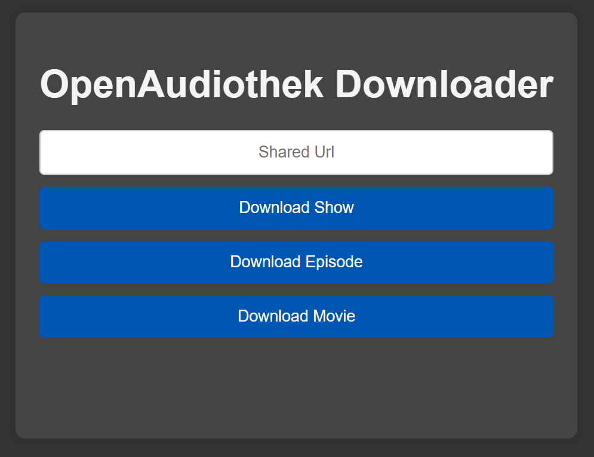

# Lightweight ARD-Audiothek-Downloader

Es handelt sich um eine kleine selfhosetd Web-App, welche Hörbücher und Podcasts von der ARD-Audiothek herunterladen kann. 

## Vorraussetzungen / Installation

Installation von Docker:

__Windows:__

1. Download und Installation von [Docker-Desktop](https://docs.docker.com/desktop/setup/install/windows-install/). Danach starten von Docker-Desktop.
2. Anlegen einer neuen Textdatei unter zB. %userprofile%\Music\openAudiothekDownloader
3. Inhalt der [compose.yaml](./compose.yaml) in die Textdatei einfügen, für Windows anpassen und danach in compose.yaml umbenennen.
4. Powershell öffnen: 
```
Tastenbefehl: Win+R
POWERSHELL eingeben
Enter drücken
```
Zu dem Ordner navigieren:
```
cd $env:USERPROFILE\Music\openAudiothekDownloader
```
5. Docker Compose mit der zuvor erstellten compose.yaml ausführen:
```
docker compose up -d --force-recreate
```
6. Im Browser den selbstgehosteten Service aufrufen:
```
http://localhost:5000/
```
7. Zum Beenden des Services:
```
docker compose down
```

__Linux:__
1. Installation von Docker-Compose zB über das Terminal:
```
apt-get install ca-certificates curl
install -m 0755 -d /etc/apt/keyrings
curl -fsSL https://download.docker.com/linux/debian/gpg -o /etc/apt/keyrings/docker.asc
chmod a+r /etc/apt/keyrings/docker.asc

echo   "deb [arch=$(dpkg --print-architecture) signed-by=/etc/apt/keyrings/docker.asc] https://download.docker.com/linux/debian \
$(. /etc/os-release && echo "$VERSION_CODENAME") stable" |   tee /etc/apt/sources.list.d/docker.list > /dev/null
   
apt-get update
apt-get install docker-ce docker-ce-cli containerd.io docker-buildx-plugin docker-compose-plugin docker-compose
```
2. compose.yaml in neuem Ordner speichern.
3. Docker Compose mit der zuvor erstellten compose.yaml ausführen:
```
docker compose up -d --force-recreate
```
4. Im Browser den selbstgehosteten Service aufrufen:
```
http://localhost:5000/
```
5. Zum Beenden des Services:
```
docker compose down
```

## Nutzung
Link der ersten Folge einfügen und herunterladen.

Die ausgewählte und kommende Folgen werden in das ausgewählte Verzeichnis heruntergeladen. 

Alternativ Link der Serienübersicht einfügen und herunterladen.
Hierbei werden allerdings häufig nicht alle Folgen erfasst und heruntergeladen.
